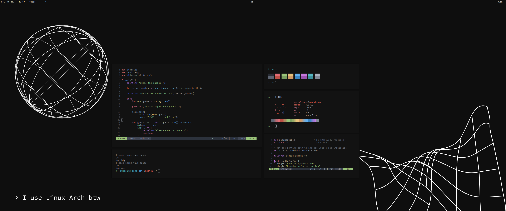

# 🛠️ martiliones' dotfiles

<p align="center">
  
</p>

## 🚀 Installation

> **Warning:** If you want to give these dotfiles a try, you should first fork this repository, review the code, and remove things you don’t want or need. Don’t blindly use my settings unless you know what that entails. Use at your own risk!

### Using Git and the bash script

You can clone the repository wherever you want. (I like to keep it in `~/Projects/dotfiles`, with `~/dotfiles` as a symlink.) The bootstrapper script will pull in the latest version and copy the files to your home folder.

```bash
git clone https://github.com/martiliones/dotfiles.git && cd dotfiles && sh ./install.sh
```

## 🙌 Thanks
**VS Code Theme**: Theme by <a href="https://github.com/antfu">Anthony Fu</a> on <a href="https://github.com/antfu/vscode-theme-vitesse">GitHub</a>
